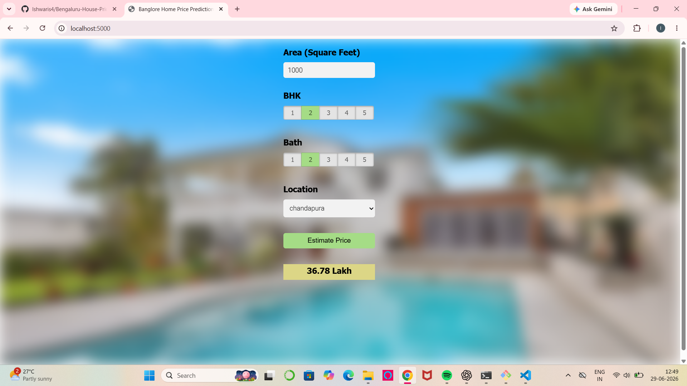
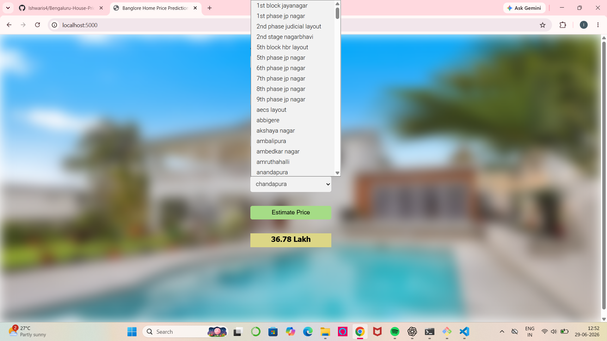

# Bengaluru House Price Prediction

A Machine Learning web application that predicts house prices in Bengaluru based on:

- Area (Square Feet)
- Number of Bedrooms
- Bathrooms
- Location

## Tech Stack

- Python
- Flask
- HTML
- CSS
- JavaScript
- Scikit-learn
- Pandas
- NumPy

## Dataset

Bengaluru House Prices Dataset

## Features

- Predict house prices
- Dynamic location dropdown
- Responsive UI

## Run

pip install -r requirements.txt

python server.py

# Result
## Home Page

---

## Prediction Result

---

## Location Drop-down 

